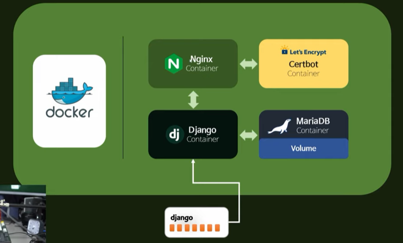
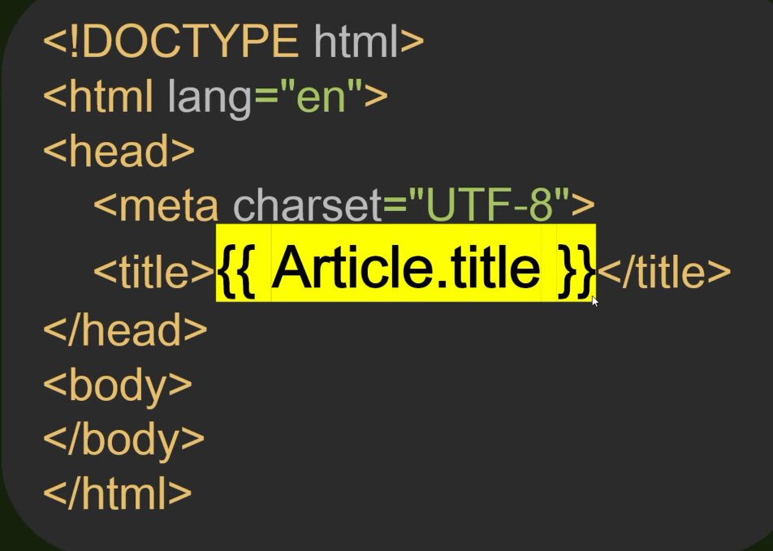
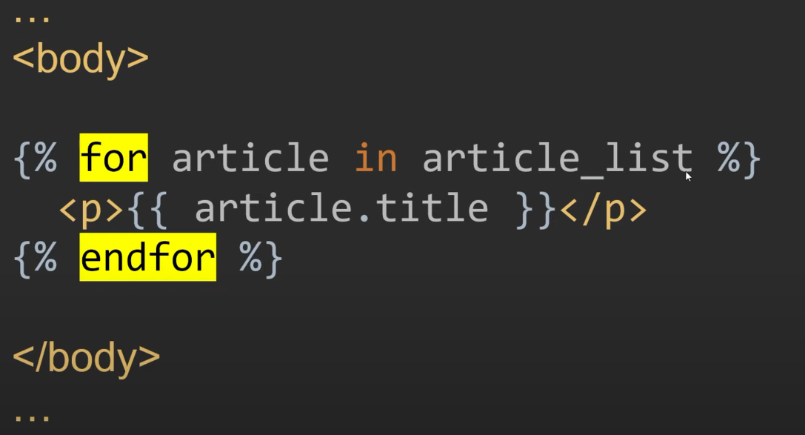
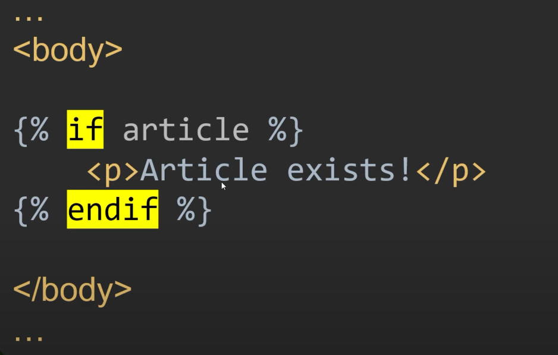
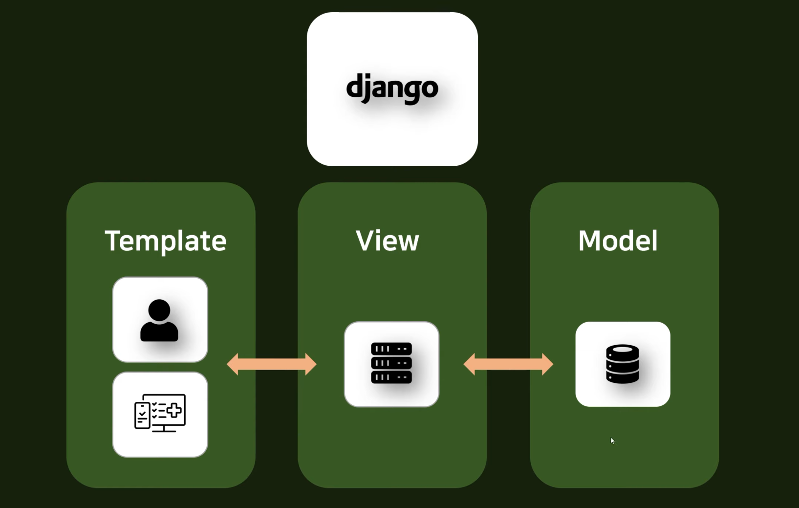

# 0329

## 1강 - 무엇을 만들 것인가

- 홈페이지 (유저별 할당 개인 페이지)
- 제목-좋아요 댓글 수-게시판-댓글 등
- 서브레딧-프로젝트 개설
- 게시판 구독/구독취소
- 개인 페이지 설정 메뉴
- 반응형 디자인
- 등등 ...

## 2강 - 웹서비스 구조

어떤 기술들을 사용해서 만들 것인가?

- Front-End : HTML, CSS, (JS)
- Back-End : (maria-db), nginx, django, docker

#### django

장고 내부에서 여러가지 앱이 생성될 것 (기능별로 나눈다)

- Account : 계정
- Article : 게시글
- Project
- Comment
- ...

#### django Container

위의 서비스를 모두 구축하고 나면 도커 안의 하나의 컨테이너가 된다.

그렇게 만든 장고 서비스를 장고 컨테이너로 만들어서 도커 안에 밀어넣을 것이다.

- 장고 컨테이너 : 장고에 관련된 일
- 마리아DB 컨테이너 : DB에 관련된 일
- Nginx 컨테이너 : 서버에 관련된 일

#### VULTR

가상 서버 대여 업체에 실제 서버를 빌려서 우리가 구축한 도커 시스템을 올릴 것

전세계 사람들이 우리가 만든 서비스를 볼 수 있게 할거야(서버 배포)

## 3강 - 개발환경 셋업

파이참 이용

## 4강 - django 개발 패턴

Model

View

Template

**MTV**

- Model

  - 데이터베이스와 통신해주는 편리한 도구
  - 객체를 데이터베이스에 저장하는 과정을 편리하게 해주는 것
  - 굳이 db 언어를 사용하지 않고도 데이터베이스를 수정할 수 있게 해준다.
  - 행-열로 구성되어 있는 것을 모델로 설정해줄 수 있다.

  

- View

  - 계산하는 것을 담당하는 곳
    1. 유저가 서버에 요청을 한다
    2. 서버는 이러저러한 것들을 처리한다
    3. 유저에게 응답해준다.

- Template

  - html, css, js로 구성되어 있다.

  - 유저는 웹사이트의 비주얼을 보게 될 것.

  - 이 유저 인터페이스를 구성하는 곳.

  - 어떤 게시글에 대한 요청을 유저가 보냈을 때 HTML등을 이용해서 동적으로 보여줌

    - 예시

    

    

- 정리

  