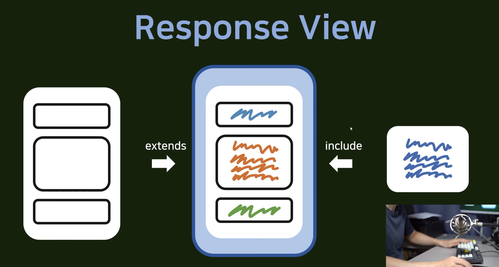

# 0330


## 5강 - 첫 앱 시작, 그리고 기본적인 view 만들기

파이썬 이용

- 가상환경 켜는 명령어

  ```bash
  source venv/Scripts/activate
  ```

  


## 6강 - Git의 소개

- git : 버전 관리 시스템 (Version Control)

  - 개발을 해나갈 때 롤백을 할 수 있게 해준다

  - branch : 개발/배포/테스트 버전
    - 추가적인 버전을 만들면서 기존의 버전에 영향을 주고 싶지 않을 때 이용
    - 합치고 싶을 때 merge를 이용
  - Team Work


- Git command
  - add
  - commit
  - push
  - pull
  - branch
  - checkout


## 7강 - Gitignore 설정, 환경변수 분리, 첫 커밋

파이참 이용


## 8강 - 장고 Template extends include 구문, render

HTML을 사용한 장고 템플릿

- HTML
  - Hyper Text : 문서 간 이동이 가능한 텍스트
  - Markup Language


- django Template
  - extends
    - HTML을 가져온다.
    - 미리 만들어 놓은 HTML 파일을 바탕으로 안에 있는 블럭을 채워나간다.
    - 바탕을 깔아주는 느낌
  - include
    - HTML을 가져온다.
    - 조그만한 조각을 가져와서 탬플릿 안에다가 집어넣는다.
    - 더미를 가져와서 붙여넣는 느낌


