# 0331

## 9강 - include/extends/block 구문을 이용한 뼈대 html 만들기

파이참 이용

## 10강

파이참 이용

## 11강

파이참 이용

## 12강 - css 핵심 - display 속성 및 size 단위 px, em, rem, %

CSS : Cascading Style Sheet

​	html을 꾸미기 위한 디자인의 모음

ESSENTIALS

- DISPLAY Attribute

  - 태그들마다 display 속성이 존재한다.

  - Block : 부모의 최대한의 너비를 가진다.

    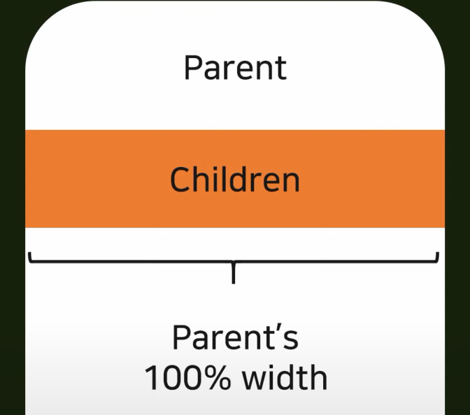

  - Inline

    - 글씨가 들어가 있으면 그 글씨의 높이만큼만 가져간다.

    - 여러 개 있으면 옆으로 늘어난다.

      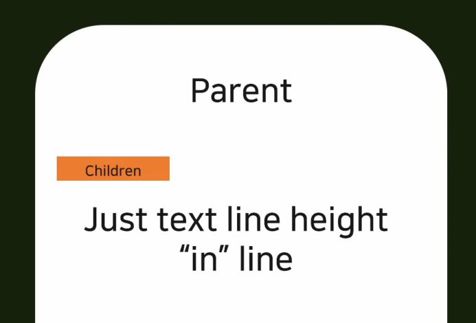

  - Inline-block

    - 블록인데 인라인처럼 오른쪽으로 쌓인다.

      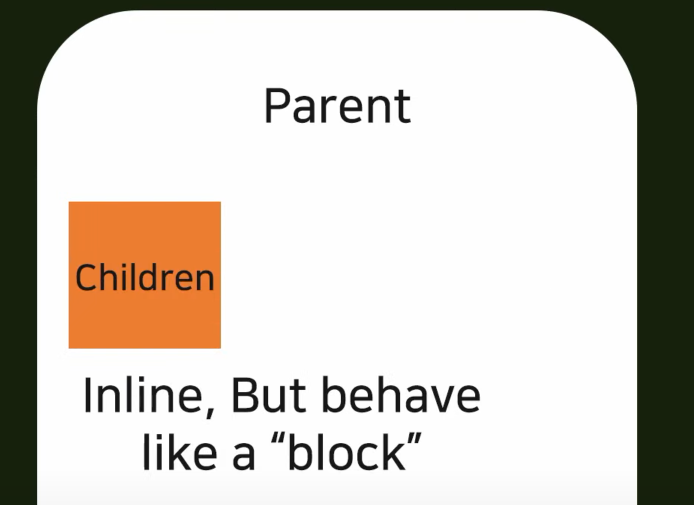

  - None

    - 말그대로 None

      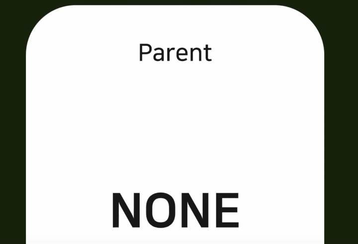

- Visibility Attribute(시각화 속성) 

  - Hidden vs None

    - None
      - child 1 이 None으로 바뀌면 child 1이 아예 없는 것처럼 표시된다.
    
    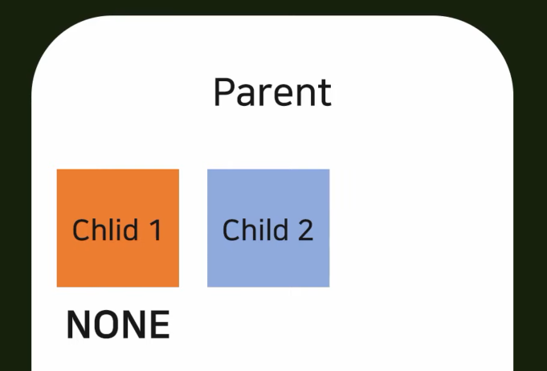
    
    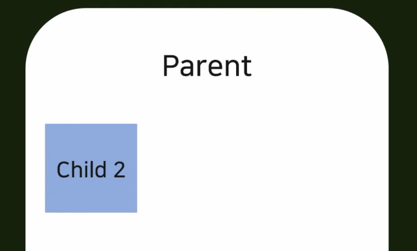
    
    - Hidden
    
      - 보이지만 않을 뿐 존재하므로 공간을 차지한다.
    
      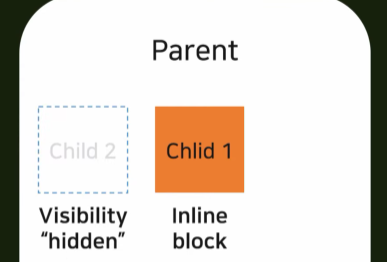

- SIZE Attribute

  - px

    - 부모의 사이즈가 어떻게 되든 고정된 크기를 가진다.
    - 폰트의 사이즈에도 영향을 받지 않는다.

    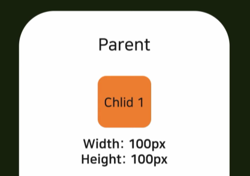

  - em

    - 부모의 값에 따라 크기가 달라진다.

      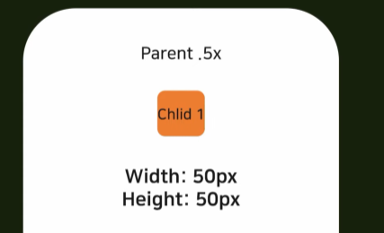

    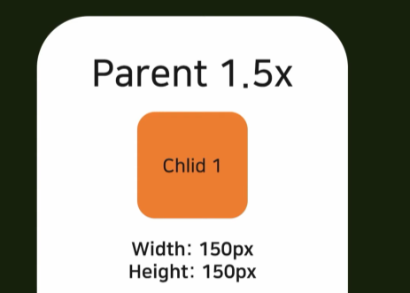

    - 부모가 여러 개 있을 때 부모의 모든 속성을 합해서(2배 2배일 때 4배) 적용한다.

      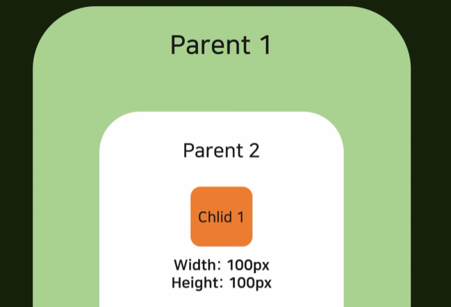

      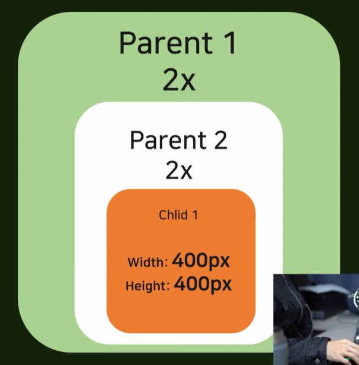

  - :star: rem : 거의 모든 곳에 사용할 것.

    - root HTML 값에 연결되어 있다. 따라서 바로 위의 부모에는 영향을 받지 않게 된다. root HTML의 디폴트 사이즈에 영향을 받는다.

      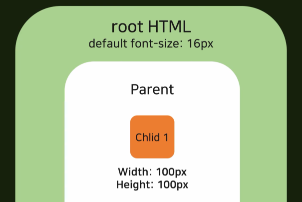

      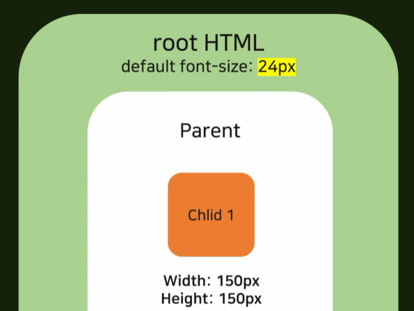

  - %

- SIZE Attribute 정리	
  - px : 관계없다
  - em : 합산
  - rem : 최 상단 폰트사이즈에 관련있다.
  - % : 바로 위 부모의 영향

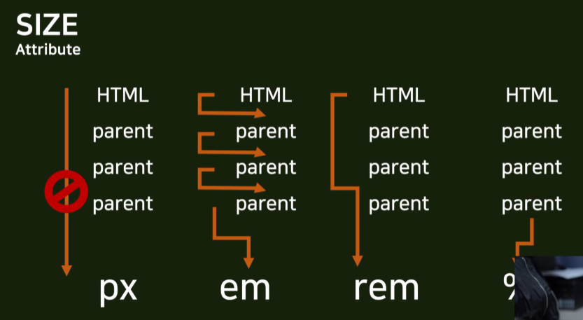
