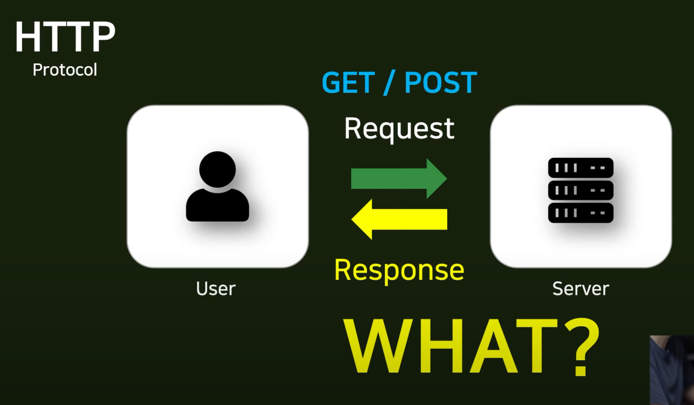
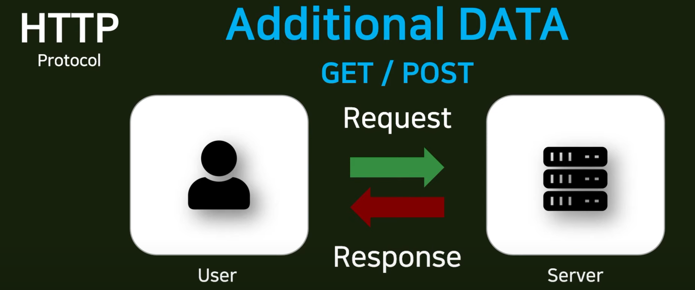

# 0403

## 13강 - CSS display 속성, rem 단위 실습

파이참 이용

## 14강 - Model, DB 연동 - makemigrations, migrate

-  데이터베이스와 장고를 연결

- 로우와 컬럼이 객체, 속성으로 연결된다.

> 파이참으로 넘어감

## 15강 - HTTP 프로토콜 GET, POST

HTTP Protocol

- 컴퓨터와 컴퓨터 사이에 통신할 때 사용되는 규약
- GET 과 POST 가 있다.

- GET vs POST

  - 서버가 원하는 것을 보내준다.

    

  

  - 서버가 원하는 것이 무엇인지 알아보고 보내주는 것이 GET과 POST

    

- 만들고자 하는 주소가 있는 경우

  - GET : 조회를 하기 위해 사용됨

    - 새로운 것을 만드는 것 보다는 데이터가 적다.
    - 주소 안에 추가적인 파라미터를 넣어서 데이터를 보내준다.
    - 브라우저 주소창 안에 들어감

  - POST : 서버 내의 어떤 정보를 새로 만들거나 수정할 때 사용

    - BODY라는 응답 내부의 몸통에 데이터를 넣어서 보낸다.

    - 브라우저 주소창 내부에 모든 데이터를 넣기에 한계가 있기 때문에 사용.

      

## 16강 - GET, POST 프로토콜 실습

파이참 이용