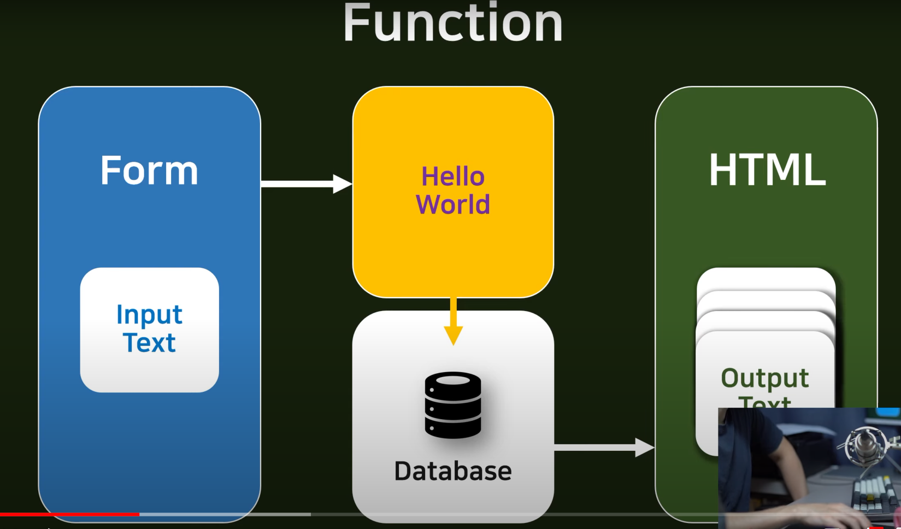
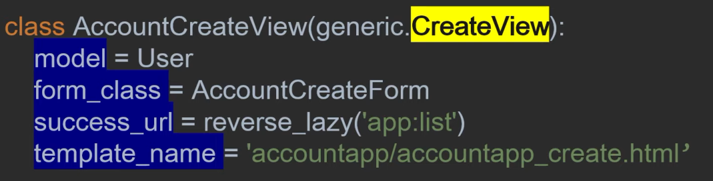

# 0404

## 17강 - POST 통신을 이용한 DB 데이터 저장 실습

DB SAVE

1. Send POST data

   포스트 데이터를 보낸다

2. Receive POST data

   포스트 데이터를 받는다

3. Save DB

   데이터를 DB에 저장한다

파이참 이용

## 18강 - DB 정보 접근 및 장고 탬플릿 내 for loop

파이참 이용

## 19강 - pycharm 디버깅 설정

파이참 이용

## 20강 - Class Based View, 장고의 CRUD

전환점이 되는 구간! 20강이나 왔다 :laughing:

지금까지 우리는 Hello world라는 function을 만들었다.

아래와 같은 규칙을 가진다.

여기서 중요한 점!

form에서 helloworld로 요청을 보낼 때, 아무나 그 요청을 보낼 수 있게 된다.

즉, 글을 쓰는 데에 아무런 제한이 없다.

그래서 우리는 인증 시스템을 구축할것이다.

Authentication (보안 시스템)

우리는 Account(계정) 이라는 객체가 필요하다.

우리는 지금 Account App을 만들고 있다. ~~까먹으면 안돼~~

그래서 우리는 계정 관련 Function들을 만들어야 한다.

- 계정 관련 function 만들것들!
  1. Sign up
     - login
  2. View info
  3. Changing info
  4. Quit

---

django는 CRUD 시스템을 이용한다.

CRUD : Create Read Update Delete > 만들고 읽고 수정하고 지우는 기능

왜 장고가 CRUD로 유명하지? > 각각 CRUD에 대한 뷰를 제공해준다!

CRUD 작업에 제공하는 도구(View) : Class Based View

<-> 반대되는 말 : Function Based View (지금까지 만든 Hello World 같은 것)

우리가 만든 소스코드를 보면

- 인풋 받고
- 저장하고
- 보내주고
- ...

같은 기능을 하나하나 구현한 함수이다.

지금은 간단해 보이지만, 사이트를 다 구현하려면..? 무지막지 길어진다 :sweat:

그래서 우리는 CRUD의 class를 이용할거야.

각각의 파라미터를 지정해주면 장고가 다 알아서 해 준다. :thumbsup:

이게 장고의 CRUD가 유명한 이유이다.

class based view를 쓰면

생산성, 가독성은 향상되고

복잡도, 쓰는 시간은 낮아진다. :thumbsup:

CRUD는 거의 모든 것에 적용될 수 있다.

게시글이든, 계정 정보든, 프로필이든, 주문이든..

거의 대부분 CRUD의 사이클 안에 들어간다.

이 사이클 안에 접목시켜서 만들면 생산성을 높일 수 있다! :happy:

---

이제 helloworld는 보내주고 다음 단계로 넘어갈거야.

Let's go!