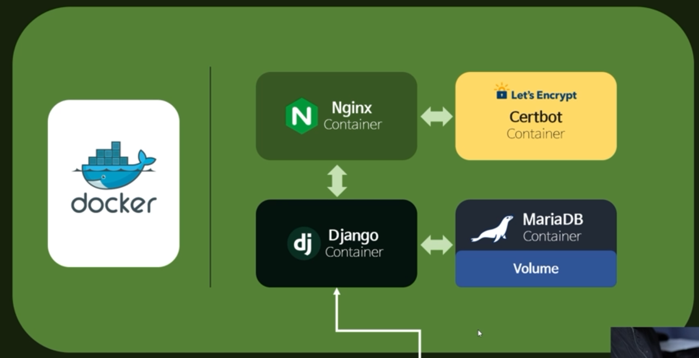
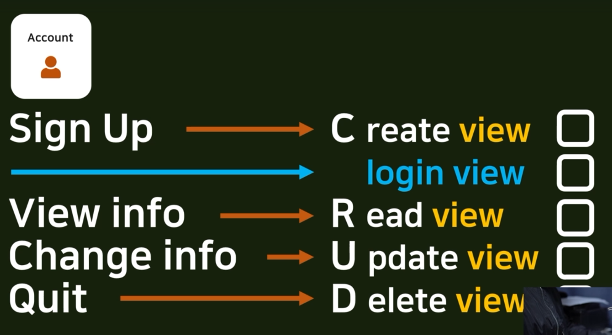
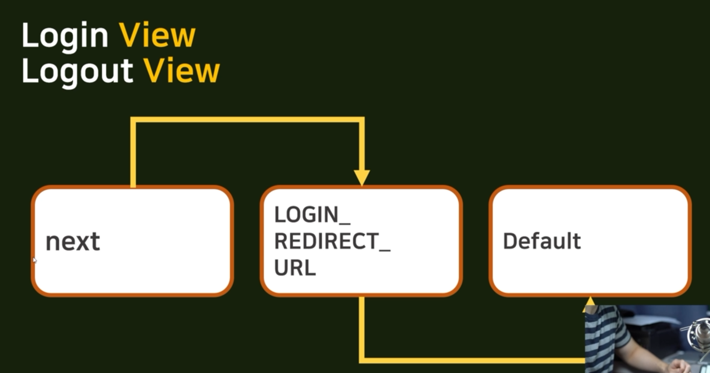

# 0405

## 21. Signup implementation with CreateView

우리의 최종 목적 : 실제 가상 서버를 빌려서 그 위에 도커 시스템을 얹는 것

네가지 부분 중에 장고 부분을 만들고 있다.

장고 컨테이너 안의 account 앱을 만들 것.

이 순서로 만들 거야

파이참 이용

## 22. Login/Logout implementation

login view logout view를 만들 것

파이참 이용

**redirect mechanism**

1. next 경로 찾기 
2. 없으면 : login_redirect_url 찾기
3. 또 없으면 default

## 23. Form design adjustment with Bootstrap

파이참 이용

## 24. Mypage implementation with DetailView

~~Read View~~ 만들 거야

장고에서 제공하는 이름 : Detail View

